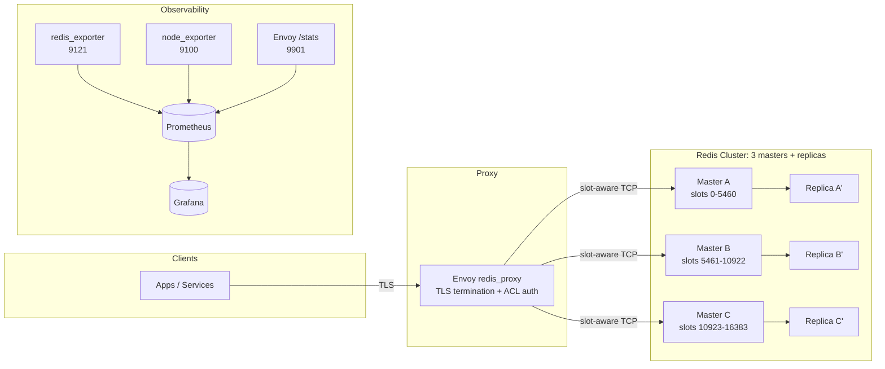
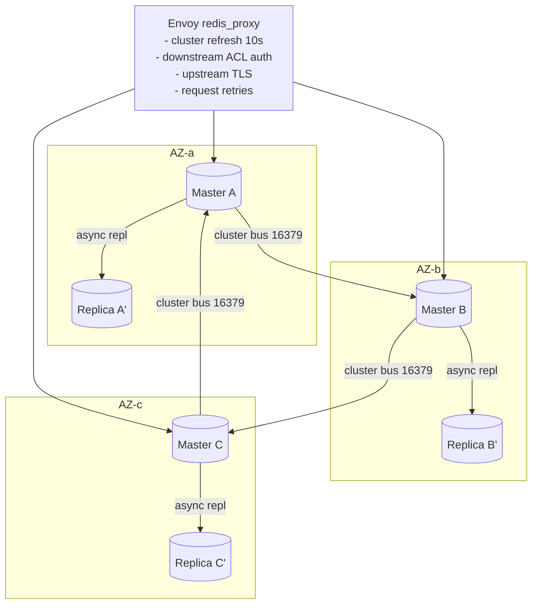
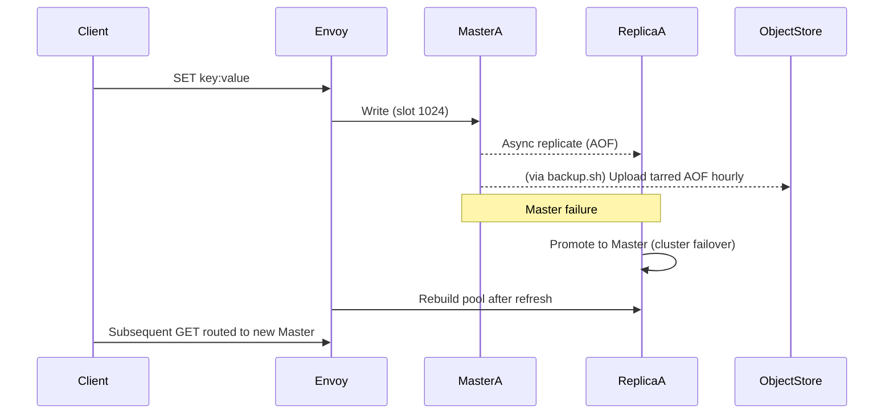

<div align="center">

# RedisForge

**Production-grade, cloud-agnostic Redis 8.4 cluster automation with Envoy, TLS, and ruthless operational discipline.**

[](./LICENSE)
[](https://redis.io/)
[](https://www.envoyproxy.io/)
[](https://www.docker.com/)
[](https://github.com/siyamsarker/RedisForge/pulls)

</div>

---

## Table of Contents

1. [Purpose & How It Works](#purpose--how-it-works)
2. [System Architecture](#system-architecture)
3. [Redis Cluster Deep-Dive](#redis-cluster-deep-dive)
4. [Auto-Failover & Persistence](#auto-failover--persistence-flow)
5. [Production Deployment Guide](#production-deployment-guide)
6. [Script Catalog & Usage](#script-catalog--usage)
7. [Monitoring & Observability](#monitoring--observability)
8. [Operations & Runbooks](#operations--runbooks)
9. [Troubleshooting Playbook](#troubleshooting-playbook)
10. [Integration Testing](#integration-testing)
11. [Repository Layout](#repository-layout)
12. [Contributing](#contributing) · [License](#license) · [Support](#support)

## Quick Links

- 📚 [Monitoring Setup Guide](docs/monitoring-setup.md)
- 📖 [Operations Runbook](docs/operations-runbook.md)
- 🤝 [Contributing Guidelines](CONTRIBUTING.md)
- 📜 [Code of Conduct](CODE_OF_CONDUCT.md)

---

## Purpose & How It Works

| Goal | Reality check |
|------|---------------|
| Provide a single, TLS-terminated Redis endpoint that hides all cluster complexity from applications. | Envoy’s `redis_proxy` terminates TLS, enforces ACL auth, understands cluster slots, and retries transparently. |
| Ship hardened Redis nodes with AOF durability and battle-tested defaults. | Custom Redis image + config templates enforce ACLs, persistence, and high file descriptor limits. |
| Offer ruthless operational automation. | Scripts bootstrap hosts, initialize clusters, scale slots, rotate logs, take backups, and simulate chaos. |
| Avoid “black box” magic. | Everything is plain Docker + Bash. You get auditable configs, no proprietary agents, and zero vendor lock-in. |

**Flow summary**
1. **Envoy node** exposes `:6379` (or `:6380` TLS) as the only endpoint apps ever see.
2. **Three Redis masters** own the 16,384 cluster slots; each master has at least one replica in another availability zone / failure domain.
3. **Cluster metadata** (slots + node health) is polled by Envoy every 10s, so applications don’t chase redirects.
4. **Persistence** uses AOF (`appendfsync everysec`) with off-host snapshots uploaded to your object store (S3/GCS/Azure Blob/MinIO/etc.).
5. **Monitoring hooks** (redis_exporter, node_exporter, Envoy metrics) feed whatever Prometheus + Grafana stack you already run.

---

## System Architecture



**Key traits**
- Only Envoy is internet/ELB facing. Redis nodes stay in private subnets.
- Envoy holds a connection pool per master, retries failed ops, and evenly balances keys via Maglev hashing.
- You run redis_exporter + node_exporter locally (per node) and scrape Envoy’s `/stats/prometheus`; Prometheus pulls everything over private IPs.

---

## Redis Cluster Deep-Dive



**Cluster mechanics**
- Slot map: 0-16383 split evenly across the three masters. Cluster metadata stored in `nodes.conf` and polled by Envoy.
- Replication: asynchronous, TLS-enabled, uses dedicated ACL user to keep secrets scoped.
- Health: `cluster-node-timeout` = 5s; nodes mark peers down fast, so failover finishes in ~10-15 seconds.
- Sentinel: optional; Redis native cluster failover already covers master promotion, but Sentinel can be layered on if you want deterministic quorum voting.

---

## Auto-Failover & Persistence Flow

| Risk | Mitigation inside RedisForge |
|------|-------------------------------|
| Master dies (hardware/OS fault) | Redis cluster flags it failing, promotes replica within the same slot range. Envoy refreshes topology every 10s and drops dead upstream connections automatically. |
| Envoy sees stale topology | `cluster_refresh_rate` + redirect refresh handles MOVED/ASK replies immediately. |
| Data loss | AOF (`appendonly yes`, `appendfsync everysec`) + object-storage archive via `backup.sh`. Optional mixed mode (`aof-use-rdb-preamble yes`) keeps restart time low. |
| Replica lag spikes | Grafana board surfaces `redis_replication_lag_seconds`; run `scripts/scale.sh add` to add replicas in overloaded AZs. |



### What you must do
- **Do not** run replicas on the same hypervisor. Spread masters and replicas across at least three separate failure domains (zones/regions/providers).
- Run `backup.sh` via cron with credentials that can write to your object store of choice.
- Periodically rehearse failover: `./scripts/scale.sh remove <node>` combined with chaos tooling.

---

## Production Deployment Guide

> If you skip any of this, you’re gambling your data. Follow it step-by-step.

### 1. Design the topology (any cloud, virtualization stack, or bare metal)
| Component | Count | Baseline sizing | Ports | Notes |
|-----------|-------|-----------------|-------|-------|
| Envoy proxy | 1 (per cluster endpoint) | ≥4 vCPU / 8 GB RAM | 6379/6380, 9901 | Front-end with your load balancer / DNS; lock admin port to monitoring CIDRs. |
| Redis masters | 3 | ≥8 vCPU / 64 GB RAM + NVMe/SSD | 6379, 16379 | Place each in a different availability/failure zone (can even be different clouds). |
| Redis replicas | 3 | Mirror master sizing | 6379, 16379 | Pair each master with at least one replica housed in another zone/provider. |

Mixing providers (e.g., on-prem + AWS + Azure) is fine as long as latency between nodes stays low and security policies permit the ports above.

### 2. Prepare the OS
```bash
sudo sysctl -w net.core.somaxconn=65535
sudo sysctl -w vm.overcommit_memory=1
echo never | sudo tee /sys/kernel/mm/transparent_hugepage/enabled
sudo tee -a /etc/security/limits.conf <<'EOF'
* soft nofile 100000
* hard nofile 100000
EOF
```

### 3. Bootstrap each node
```bash
sudo yum install -y docker git jq redis
sudo systemctl enable --now docker
sudo usermod -aG docker $USER && newgrp docker
git clone https://github.com/siyamsarker/RedisForge.git
cd RedisForge && cp env.example .env
```

For detailed monitoring setup, see [docs/monitoring-setup.md](docs/monitoring-setup.md).
For operational procedures, see [docs/operations-runbook.md](docs/operations-runbook.md).

Populate `.env` with:
- `REDIS_REQUIREPASS`, `REDIS_ACL_PASS`, `REDIS_READONLY_PASS`, etc. (use `openssl rand -base64 32`)
- `REDIS_CLUSTER_ANNOUNCE_IP=<this node private IP>`
- `REDIS_MASTER_{1..3}_HOST` (private DNS / IPs for Envoy)
- `BACKUP_S3_BUCKET`, `AWS_REGION` (use any S3-compatible endpoint; for non-AWS storage supply the correct credentials/endpoint configuration)

### 4. Deploy Redis nodes (run on each master/replica host)
```bash
./scripts/deploy.sh redis
docker logs -f redis-master
```

### 5. Initialize the cluster (run once from any node with `redis-cli`)
```bash
REDIS_REQUIREPASS=$REDIS_REQUIREPASS \
./scripts/init-cluster.sh \
"10.0.1.10:6379,10.0.2.11:6379,10.0.3.12:6379,10.0.4.10:6379,10.0.5.11:6379,10.0.6.12:6379"
```

Verify:
```bash
redis-cli -h 10.0.1.10 -a "$REDIS_REQUIREPASS" cluster info
redis-cli -h 10.0.1.10 -a "$REDIS_REQUIREPASS" cluster slots
```

### 6. Deploy Envoy proxy node
```bash
./scripts/generate-certs.sh config/tls/prod
./scripts/deploy.sh envoy
curl -k https://<envoy-ip>:6379 -u app_user:$REDIS_ACL_PASS ping
```

### 7. Wire monitoring + backups
- Run `./scripts/setup-exporters.sh` on every Redis host.
- Schedule `backup.sh` + `log-rotate.sh` via cron (see [Operations](#operations--runbooks)).
- Import Grafana dashboard JSON and create Prometheus alerts.

---

## Script Catalog & Usage

| Script | When to run | What it does | Example |
|--------|-------------|--------------|---------|
| `scripts/deploy.sh redis|envoy|monitoring` | Bootstrapping or rebuilding a node | Builds Docker images, validates TLS secrets, runs containers with health checks. | `sudo ./scripts/deploy.sh redis` |
| `scripts/init-cluster.sh <nodes>` | After all nodes are up | Creates the Redis cluster, pairs masters with replicas, validates state. | `./scripts/init-cluster.sh "host1:6379,...,host6:6379"` |
| `scripts/scale.sh add|remove` | Adding masters/replicas or decommissioning | Adds nodes, rebalances slots, or drains/removes nodes safely. | `./scripts/scale.sh add 10.0.4.15:6379 --role replica --replica-of <master-id>` |
| `scripts/backup.sh` | Hourly via cron | Archives the newest AOF + `nodes.conf` and uploads to an S3-compatible object store. | `BACKUP_S3_BUCKET=s3://prod-redis ./scripts/backup.sh` |
| `scripts/log-rotate.sh <dir> <sizeMB> <count>` | Daily via cron | Rotates Redis logs, compresses old copies, enforces retention. | `./scripts/log-rotate.sh /var/log/redis 1024 7` |
| `scripts/test-cluster.sh <host> <port>` | Smoke tests after deploy or failover | Runs PING, SET/GET, pub/sub, cluster info checks through Envoy. | `./scripts/test-cluster.sh envoy.company.local 6379` |
| `scripts/setup-exporters.sh` | After Redis deploy on every node | Launches redis_exporter + node_exporter via Docker (host networking). | `./scripts/setup-exporters.sh` |
| `tests/run-integration.sh` | In CI or before large changes | Spins up full cluster in Docker Compose, initializes slots, runs tests. | `./tests/run-integration.sh` |
| `scripts/generate-certs.sh <dir>` | Rotating TLS certs | Issues self-signed certs for lower envs; replace with CA certs in prod. | `./scripts/generate-certs.sh config/tls/prod` |

If you don’t know **exactly** why you are running a script, stop. Blind automation is how you lose data.

---

## Monitoring & Observability

1. **Exporters (per Redis host)**
   ```bash
   ./scripts/setup-exporters.sh
   curl http://localhost:9121/metrics | head   # redis_exporter
   curl http://localhost:9100/metrics | head   # node_exporter
   ```
2. **Prometheus**
   - Add the scrape jobs shown below to your existing `prometheus.yml`:
     ```yaml
     - job_name: 'redisforge-redis'
       static_configs:
         - targets: ['10.0.1.10:9121','10.0.2.11:9121','10.0.3.12:9121']
     - job_name: 'redisforge-node'
       static_configs:
         - targets: ['10.0.1.10:9100','10.0.2.11:9100','10.0.3.12:9100']
     - job_name: 'redisforge-envoy'
       metrics_path: /stats/prometheus
       static_configs:
         - targets: ['envoy-vpc.internal:9901']
     ```
   - Reload Prometheus: `curl -X POST http://<prom-host>:9090/-/reload`
3. **Alertmanager (Discord-ready)**
   - File: `monitoring/alertmanager/alertmanager.yaml`
   - Steps:
     1. Create a Discord webhook in your server (Server Settings → Integrations → Webhooks).
     2. Replace every `<YOUR_DISCORD_WEBHOOK_URL>` in the file with the real webhook URL (append `/slack`).
     3. Deploy Alertmanager with that file (`docker run prom/alertmanager ... -config.file=/etc/alertmanager/alertmanager.yaml`).
     4. Test:  
        ```bash
        curl -XPOST http://<alertmanager-host>:9093/api/v1/alerts -d '[{"labels":{"alertname":"Test","severity":"warning"},"annotations":{"summary":"Discord test"}}]'
        ```  
        A message should hit your Discord channel.
4. **Grafana dashboard**
   - File: `monitoring/grafana/dashboards/redisforge-dashboard.json`
   - Import via Grafana UI → Dashboards → Import → Upload JSON.
   - Datasource configuration lives under `monitoring/grafana/provisioning/datasources/`; point it to your Prometheus endpoint.

Key metrics to never ignore:
- `redis_cluster_slots_ok` (<16384 = fire drill)
- `redis_connected_slaves` (should match replica targets)
- `redis_aof_current_size_bytes` vs disk usage
- `envoy_cluster_upstream_rq_xx{response_code_class="5"}`

---

## Operations & Runbooks

### Scaling
```bash
# Add an additional master (rebalances slots)
REDIS_REQUIREPASS=$PASS ./scripts/scale.sh add 10.0.7.10:6379 --role master

# Add replica pinned to master ID
REDIS_REQUIREPASS=$PASS ./scripts/scale.sh add 10.0.8.11:6379 --role replica --replica-of <master-node-id>

# Remove node after draining slots
REDIS_REQUIREPASS=$PASS ./scripts/scale.sh remove <node-id>
```

### Backups & retention
```bash
BACKUP_S3_BUCKET=s3://prod-redisforge ./scripts/backup.sh
# Cron: 0 * * * * BACKUP_S3_BUCKET=s3://prod-redisforge /opt/RedisForge/scripts/backup.sh >> /var/log/redisforge-backup.log 2>&1
```

### Log rotation
```bash
./scripts/log-rotate.sh /var/log/redis 1024 7
# Cron: 0 2 * * * /opt/RedisForge/scripts/log-rotate.sh /var/log/redis 1024 7
```

### TLS rotation
```bash
./scripts/generate-certs.sh config/tls/prod
rsync config/tls/prod/* envoy-host:/etc/envoy/certs
docker restart envoy-proxy
```

### Health spot-checks
```bash
redis-cli -h envoy.company.local -p 6379 --tls --cacert config/tls/prod/ca.crt -a "$REDIS_REQUIREPASS" ping
curl -s https://envoy.company.local:9901/stats/prometheus | grep envoy_cluster_upstream_rq_time_bucket | head
```

---

## Troubleshooting Playbook

| Symptom | Quick triage | Root fix |
|---------|--------------|----------|
| `redis-cli` through Envoy returns `MOVED` constantly | Envoy can’t refresh topology (wrong Redis auth or TLS). Check Envoy logs + `/clusters`. | Ensure `REDIS_REQUIREPASS` matches across Redis + Envoy env vars; verify `/etc/envoy/certs`. |
| Slots `<16384` or `cluster_state:fail` | `redis-cli --cluster check <node>` | Replace failed nodes, run `./scripts/scale.sh remove <dead-node-id>`, then add new replica. |
| Backups missing in object store | Check `/var/log/redisforge-backup.log` and credentials. | Ensure the IAM/user/service-account used by the host can write to the bucket, confirm `BACKUP_S3_BUCKET`/endpoint vars, then rerun `backup.sh`. |
| High replication lag | `redis-cli info replication | grep lag` | Investigate network saturation, add replicas, or reshard heavy slots off overloaded master. |
| Envoy admin port inaccessible | Security group or firewalls blocking 9901. | Allow Prometheus CIDRs; never expose 9901 publicly. |
| Containers crash-loop | `docker logs redis-master` or `docker logs envoy-proxy` | Usually missing secrets or wrong env vars. Re-create `.env`, redeploy with correct TLS paths. |

**Golden rule:** never restart everything at once. Fix one component, validate, then move on. Chaos is contagious.

---

## Integration Testing

See [`tests/run-integration.sh`](tests/run-integration.sh) for the full automated test suite.

**Quick test**:

```bash
./tests/run-integration.sh
```

Validates:
- ✅ PING through Envoy
- ✅ SET/GET operations
- ⚠️ Pub/Sub (see limitations below)
- ✅ Cluster failover
- ✅ Data persistence

If this fails locally, **do not** deploy to production. Fix the tests first.

---

## Known Limitations

### Pub/Sub Through Envoy

> **⚠️ IMPORTANT**: Redis Pub/Sub is **not fully supported** when routing through Envoy's `redis_proxy` in cluster mode.

**Why**: Envoy's Redis proxy is designed for request/response commands (GET, SET, etc.) and doesn't maintain the long-lived connections required for Pub/Sub subscriptions.

**Workarounds**:
1. **Direct connection**: Connect directly to Redis nodes for Pub/Sub (bypass Envoy)
2. **Alternative messaging**: Use Redis Streams or external message brokers (RabbitMQ, Kafka) for pub/sub patterns
3. **Separate cluster**: Deploy a dedicated Redis instance (non-cluster) for Pub/Sub behind Envoy

**Testing**: Pub/Sub tests are expected to fail in `test-cluster.sh` when testing through Envoy.

---

## Repository Layout

```
RedisForge/
├── config/                    # Envoy + Redis templates, TLS helper docs
├── docker/                    # Hardened Dockerfiles + entrypoints
├── docs/quickstart.md         # Extended deployment walkthrough
├── monitoring/                # Alertmanager + Grafana assets
├── scripts/                   # Automation (deploy, scale, backup, etc.)
├── tests/                     # Integration harness
├── env.example
├── LICENSE
└── README.md
```

---

## Contributing

1. Fork the repo, branch off `main`.
2. Make your changes + update docs.
3. Run `./tests/run-integration.sh` (or your CI equivalent).
4. Open a PR with logs/screenshots. No tests = no merge.

See [CONTRIBUTING.md](CONTRIBUTING.md) for full guidelines and [CODE_OF_CONDUCT.md](CODE_OF_CONDUCT.md) for our community standards.

Keep scripts idempotent, don’t hardcode secrets, and document every operational change.

---

## License

RedisForge is distributed under the [MIT License](./LICENSE).

---

## Support

- Issues & ideas: [GitHub Issues](https://github.com/your-org/RedisForge/issues)
- Discussions & design questions: open a Discussion or PR.
- Security disclosures: contact the maintainers privately.

Built for operators who refuse to trust luck more than discipline.
