<div align="center">

# RedisForge

**Production-ready Redis 8.2 OSS cluster with high availability, AOF persistence, and Envoy proxy**

Designed for millions of requests per minute on AWS EC2 using Docker.  
Complete automation for cluster lifecycle, scaling, monitoring, and backups.

[](./LICENSE)
[](https://redis.io/)
[](https://www.envoyproxy.io/)
[](https://www.docker.com/)
[](https://prometheus.io/)
[](https://grafana.com/)
[](https://aws.amazon.com/ec2/)
[](https://www.gnu.org/software/bash/)

[](https://github.com/siyamsarker/RedisForge/graphs/commit-activity)
[](https://github.com/siyamsarker/RedisForge/pulls)
[](https://github.com/siyamsarker/RedisForge/stargazers)
[](https://github.com/siyamsarker/RedisForge/network/members)
[](https://github.com/siyamsarker/RedisForge/issues)

</div>

---

## 📋 Table of Contents

<details open>
<summary><b>Getting Started</b></summary>

- [🎯 Overview](#-overview)
- [💡 Why RedisForge](#-why-redisforge)
- [🏗️ Architecture](#️-architecture)
- [✨ Features](#-features)
- [📦 Requirements](#-requirements)

</details>

<details open>
<summary><b>Deployment & Configuration</b></summary>

- [🚀 Quick Start](#-quick-start)
- [📊 Monitoring Setup](#-monitoring-setup)

</details>

<details open>
<summary><b>Operations & Maintenance</b></summary>

- [🔧 Operations](#-operations)
- [🔍 Troubleshooting](#-troubleshooting)
- [📊 Key Metrics](#-key-metrics)

</details>

<details open>
<summary><b>Documentation & Resources</b></summary>

- [📁 Repository Structure](#-repository-structure)
- [📚 Documentation Guides](#-documentation-guides)
- [🤝 Contributing](#-contributing)
- [📄 License](#-license)
- [🙏 Acknowledgments](#-acknowledgments)
- [📞 Support](#-support)

</details>

---

## 🎯 Overview

RedisForge is a production-ready Redis 8.2 OSS cluster deployment with:

- **Single Endpoint**: Envoy proxy handles routing, sharding, and failover transparently
- **High Availability**: Multi-AZ masters with replicas and automatic failover
- **Durable**: AOF persistence with `appendfsync everysec`
- **Observable**: Push-based monitoring with Prometheus and Grafana
- **Automated**: Complete lifecycle management with idempotent Bash scripts

Perfect for applications requiring millions of requests per minute with zero downtime.

---

## 💡 Why RedisForge

| Feature | Benefit |
|---------|---------|
| **Single Endpoint** | Clients connect to Envoy; no topology changes in app code |
| **Envoy redis_proxy** | Intelligent routing, retries, health checks, circuit breakers |
| **AOF Persistence** | Data durability with `everysec` fsync strategy |
| **Multi-AZ HA** | Automatic failover across availability zones |
| **Push-Based Monitoring** | Metrics pushed to Prometheus Push Gateway every 30s |
| **Automation Scripts** | Deploy, scale, backup, rotate logs - all automated |
| **No TLS Overhead** | Optimized for performance (TLS removed for speed) |
| **Docker-Based** | Easy deployment, consistent environments |

---

## 🏗️ Architecture

```mermaid
graph TB
    subgraph "Client Layer"
        Apps[📱 Applications<br/>Single Endpoint]
    end
    
    subgraph "Proxy Layer"
        Envoy[🔀 Envoy Proxy v1.32<br/>━━━━━━━━━━━━━<br/>• redis_proxy filter<br/>• Maglev consistent hashing<br/>• Health checks & retries<br/>• Circuit breakers<br/>• Topology refresh: 10s]
    end
    
    subgraph "Data Layer - Multi-AZ"
        subgraph "AZ-a us-east-1a"
            M1[🔴 Redis Master 1<br/>Hash Slots: 0-5460<br/>AOF: everysec]
            R1[🔵 Replica 1]
            M1 -.->|replication| R1
        end
        
        subgraph "AZ-b us-east-1b"
            M2[🔴 Redis Master 2<br/>Hash Slots: 5461-10922<br/>AOF: everysec]
            R2[🔵 Replica 2]
            M2 -.->|replication| R2
        end
        
        subgraph "AZ-c us-east-1c"
            M3[🔴 Redis Master 3<br/>Hash Slots: 10923-16383<br/>AOF: everysec]
            R3[🔵 Replica 3]
            M3 -.->|replication| R3
        end
    end
    
    subgraph "Monitoring Layer"
        Exporters[📊 Exporters<br/>redis_exporter + node_exporter]
        PushGW[⬆️ Push Gateway<br/>Metrics Buffer]
        Prom[📈 Prometheus<br/>Time-Series DB]
        Grafana[📉 Grafana<br/>Dashboards]
        Discord[💬 Discord<br/>Alerts]
    end
    
    Apps -->|Redis Protocol<br/>Port 6379| Envoy
    Envoy -->|Key-based<br/>routing| M1
    Envoy -->|Key-based<br/>routing| M2
    Envoy -->|Key-based<br/>routing| M3
    
    M1 <-.->|Cluster Bus<br/>16379| M2
    M2 <-.->|Cluster Bus<br/>16379| M3
    M3 <-.->|Cluster Bus<br/>16379| M1
    
    M1 --> Exporters
    M2 --> Exporters
    M3 --> Exporters
    Envoy --> Exporters
    
    Exporters -->|Push every 30s| PushGW
    PushGW -->|Scrape| Prom
    Prom --> Grafana
    Prom --> Discord
    
    classDef apps fill:#e1f5ff,stroke:#01579b,stroke-width:2px
    classDef proxy fill:#fff3e0,stroke:#e65100,stroke-width:3px
    classDef master fill:#ffebee,stroke:#c62828,stroke-width:2px
    classDef replica fill:#e3f2fd,stroke:#1565c0,stroke-width:2px
    classDef monitor fill:#f3e5f5,stroke:#6a1b9a,stroke-width:2px
    
    class Apps apps
    class Envoy proxy
    class M1,M2,M3 master
    class R1,R2,R3 replica
    class Exporters,PushGW,Prom,Grafana,Discord monitor
```

<div align="center">



</div>

### 📐 Architecture Overview

| Layer | Component | Purpose | Key Features |
|-------|-----------|---------|--------------|
| **Client** | Applications | Connect via single endpoint | No topology awareness needed |
| **Proxy** | Envoy v1.32 | Intelligent Redis proxy | Maglev hashing, auto-retry, health checks |
| **Data** | Redis 8.2 Cluster | Distributed key-value store | 16,384 slots, AOF persistence, multi-AZ |
| **Monitoring** | Push-based metrics | Observability stack | 30s push interval, Grafana dashboards |

### 🔄 Data Flow

1. **Client Request** → Application sends Redis command to Envoy (`:6379`)
2. **Smart Routing** → Envoy hashes key and routes to correct Redis master
3. **Cluster Execution** → Redis master executes command and replicates to replica
4. **Response** → Result returns through Envoy to application
5. **Monitoring** → Exporters push metrics every 30s to Push Gateway → Prometheus

### 🛡️ High Availability

- **Multi-AZ Deployment**: 3 availability zones for fault tolerance
- **Automatic Failover**: Replicas promoted to masters if master fails
- **Health Checks**: Envoy detects unhealthy nodes and routes around them
- **Circuit Breakers**: Prevents cascade failures under load
- **Connection Pooling**: Efficient connection reuse reduces latency

### 📊 Monitoring Architecture

```
┌─────────────┐     ┌──────────────┐     ┌─────────────┐     ┌──────────┐
│  Exporters  │────▶│ Push Gateway │────▶│ Prometheus  │────▶│ Grafana  │
│  (9121/9100)│ 30s │   (Buffer)   │ 15s │  (Storage)  │     │ (Viz)    │
└─────────────┘     └──────────────┘     └─────────────┘     └──────────┘
                                                  │
                                                  ▼
                                          ┌──────────────┐
                                          │   Discord    │
                                          │   Alerts     │
                                          └──────────────┘
```

**Key Metrics Tracked:**
- Redis: ops/sec, memory usage, keyspace hits/misses, replication lag
- Envoy: request rate, latency (p50/p95/p99), error rate, upstream health
- System: CPU, memory, disk I/O, network throughput

---

## ✨ Features

### Redis

- ✅ **Redis 8.2 OSS** in cluster mode (latest stable)
- ✅ **AOF Persistence** with `appendfsync everysec`
- ✅ **Multi-AZ Deployment** for high availability
- ✅ **ACL Authentication** with role-based access
- ✅ **Memory Eviction** policies (configurable)
- ✅ **Performance Optimized** for high throughput

### Envoy Proxy

- ✅ **Redis Proxy Filter** with cluster discovery
- ✅ **Topology Refresh** (10s default, configurable)
- ✅ **Maglev Consistent Hashing** for even distribution
- ✅ **Health Checks** & outlier detection
- ✅ **Connection Pooling** & circuit breakers
- ✅ **Automatic Retry** on failure

### Automation

- ✅ **Cluster Initialization** (`init-cluster.sh`) - Retry logic & health verification
- ✅ **Dynamic Scaling** with resharding (`scale.sh`) - Input validation & safety checks
- ✅ **Automated Backups** to S3 (`backup.sh`) - Multi-AOF support & verification
- ✅ **Log Rotation** (`log-rotate.sh`) - Portable & compressed archives
- ✅ **Integration Tests** (`test-cluster.sh`) - Comprehensive cluster validation
- ✅ **Deployment Scripts** (`deploy.sh`) - Production-ready automation
- ✅ **Production-Grade** - Error handling, validation, cleanup, portability

### Monitoring

- ✅ **Push-Based Architecture** (no pull scraping needed)
- ✅ **redis_exporter** for Redis metrics
- ✅ **node_exporter** for system metrics
- ✅ **Prometheus Push Gateway** integration
- ✅ **Pre-built Grafana Dashboard**
- ✅ **Discord Alerts** for Push Gateway issues

---

## 📦 Requirements

### Infrastructure

| Component | Specification |
|-----------|---------------|
| **AWS Account** | 3 availability zones (e.g., us-east-1a/b/c) |
| **Redis Instances** | 3× r6i.2xlarge (8 vCPU, 64 GB RAM) |
| **Envoy Instance** | 1× c6i.large (2 vCPU, 4-8 GB RAM) |
| **OS** | Amazon Linux 2023 or Ubuntu 24.04 LTS |
| **Docker** | Docker Engine 20.10+ |
| **S3 Bucket** | For backups (optional) |

### Monitoring (User-Provided)

- **Prometheus** instance for metrics collection
- **Prometheus Push Gateway** for push-based metrics
- **Grafana** instance for dashboards

### Networking

Security groups must allow:

| Service | Port | Source | Purpose |
|---------|------|--------|---------|
| Envoy | 6379 | Application SG | Redis proxy |
| Envoy | 9901 | Prometheus IP | Admin/metrics |
| Redis | 6379 | Redis SG | Cluster communication |
| Redis | 16379 | Redis SG | Cluster bus |
| Exporters | 9121, 9100 | Localhost | Metrics collection |

---

## 🚀 Quick Start

### 1. Provision EC2 Instances

Deploy 4 EC2 instances:
- 3× Redis masters (r6i.2xlarge, one per AZ)
- 1× Envoy proxy (c6i.large)

### 2. Install Docker on All Instances

```bash
# Amazon Linux 2023
sudo yum update -y
sudo yum install -y docker git redis
sudo systemctl start docker
sudo systemctl enable docker
sudo usermod -aG docker ec2-user
newgrp docker

# Ubuntu 24.04 LTS
sudo apt update
sudo apt install -y docker.io docker-compose-v2 git redis-tools
sudo systemctl start docker
sudo systemctl enable docker
sudo usermod -aG docker ubuntu
newgrp docker
```

### 3. Clone Repository

On all instances:

```bash
git clone https://github.com/your-org/RedisForge.git
cd RedisForge
```

### 4. Configure Environment

```bash
cp env.example .env

# Generate strong passwords
REDIS_PASS=$(openssl rand -base64 32)
echo "REDIS_REQUIREPASS=$REDIS_PASS" >> .env

# Edit .env and set:
# - REDIS_REQUIREPASS (use generated password)
# - REDIS_MAXMEMORY (e.g., 48gb for 64GB instance)
# - PROMETHEUS_PUSHGATEWAY (your Push Gateway URL)
# - METRICS_PUSH_INTERVAL (default: 30 seconds)
```

### 5. Deploy Redis on Each Redis Instance

```bash
# Set announce IP to this instance's private IP
export REDIS_CLUSTER_ANNOUNCE_IP=$(hostname -I | awk '{print $1}')

# Deploy Redis
./scripts/deploy.sh redis

# Verify
docker ps | grep redis-master
```

### 6. Initialize Cluster

From any machine with redis-cli:

```bash
REDIS_REQUIREPASS=your_password \
./scripts/init-cluster.sh \
  "10.0.1.10:6379,10.0.2.11:6379,10.0.3.12:6379,10.0.1.13:6379,10.0.2.14:6379,10.0.3.15:6379"

# Verify cluster
redis-cli -h 10.0.1.10 -a your_password cluster info
```

### 7. Deploy Envoy Proxy

On Envoy instance:

```bash
./scripts/deploy.sh envoy

# Verify
docker ps | grep envoy-proxy
curl http://localhost:9901/clusters
```

### 8. Test Cluster

```bash
redis-cli -h <envoy-ip> -p 6379 -a your_password PING
# Expected: PONG

redis-cli -h <envoy-ip> -p 6379 -a your_password SET test "RedisForge"
redis-cli -h <envoy-ip> -p 6379 -a your_password GET test
# Expected: "RedisForge"
```

---

## 📊 Monitoring Setup

RedisForge uses **push-based monitoring** with Prometheus Push Gateway.

### Architecture

```
Exporters → push-metrics.sh (every 30s) → Push Gateway → Prometheus → Grafana
```

### Step 1: Deploy Monitoring Exporters

On each Redis instance:

```bash
./scripts/setup-exporters.sh
```

This deploys:
- `redis_exporter` on port 9121
- `node_exporter` on port 9100

### Step 2: Configure Push Gateway

Edit `.env` on all Redis instances:

```bash
PROMETHEUS_PUSHGATEWAY=http://your-pushgateway:9091
METRICS_PUSH_INTERVAL=30  # Push every 30 seconds
```

### Step 3: Enable Continuous Push Service

**Option A: Using systemd (Production)**

```bash
# Copy service file
sudo cp monitoring/systemd/redisforge-metrics-push.service /etc/systemd/system/

# Enable and start
sudo systemctl daemon-reload
sudo systemctl enable redisforge-metrics-push
sudo systemctl start redisforge-metrics-push

# Verify
sudo systemctl status redisforge-metrics-push
sudo journalctl -u redisforge-metrics-push -f
```

**Option B: Using screen (Testing)**

```bash
screen -S metrics-push
./scripts/push-metrics.sh
# Detach with Ctrl+A, D
```

### Step 4: Configure Prometheus

Add to your Prometheus configuration:

```yaml
scrape_configs:
  - job_name: 'pushgateway'
    honor_labels: true  # Preserve labels from pushed metrics
    static_configs:
    - targets: ['<pushgateway-host>:9091']
```

Reload Prometheus:

```bash
curl -X POST http://localhost:9090/-/reload
```

### Step 5: Import Grafana Dashboard

1. Open Grafana → Dashboards → Import
2. Upload `monitoring/grafana/dashboards/redisforge-dashboard.json`
3. Select your Prometheus datasource
4. Save

### Step 6: Configure Discord Alerts

See [`DISCORD-ALERTS-SETUP.md`](./DISCORD-ALERTS-SETUP.md) for complete setup guide.

**Quick setup:**

```bash
### Discord Webhook Integration

Set up real-time Discord notifications for Push Gateway alerts.

See [`discord-alerts-setup.md`](./docs/discord-alerts-setup.md) for complete setup guide.

```bash
# 1. Get Discord webhook URL from your server
# 2. Update alertmanager.yaml
DISCORD_WEBHOOK="https://discord.com/api/webhooks/..." 
sed -i "s|<YOUR_DISCORD_WEBHOOK_URL>|${DISCORD_WEBHOOK}|g" monitoring/alertmanager/alertmanager.yaml

# 3. Deploy Alertmanager
docker run -d \
  --name alertmanager \
  --restart=always \
  -p 9093:9093 \
  -v $(pwd)/monitoring/alertmanager:/etc/alertmanager \
  prom/alertmanager:latest \
  --config.file=/etc/alertmanager/alertmanager.yaml
```

---

## 🔧 Operations

### Scaling Up

Add a new Redis node:

```bash
# 1. Deploy Redis on new instance
./scripts/deploy.sh redis

# 2. Add to cluster (automatically validates and rebalances)
REDIS_REQUIREPASS=your_password \
SEED=10.0.1.10:6379 \
./scripts/scale.sh add 10.0.4.20:6379
```

**Features:**
- Node connectivity validation
- Automatic rebalancing
- Cluster health verification

### Scaling Down

Remove a node safely:

```bash
# 1. Get node ID
redis-cli -h 10.0.1.10 -a your_password cluster nodes

# 2. Remove node (automatically drains slots and validates)
REDIS_REQUIREPASS=your_password \
SEED=10.0.1.10:6379 \
./scripts/scale.sh remove <node-id>
```

**Features:**
- Node ID validation (40-char hex)
- Automatic slot draining
- Safe removal with health checks

### Backups

**Manual backup:**

```bash
# Backs up all AOF files and cluster config to S3
BACKUP_S3_BUCKET=s3://your-bucket/backups ./scripts/backup.sh
```

**Automated backups (cron):**

```bash
# Add to crontab
crontab -e

# Hourly backups with 7-day retention
0 * * * * cd /path/to/RedisForge && BACKUP_S3_BUCKET=s3://your-bucket/backups BACKUP_RETENTION_DAYS=7 ./scripts/backup.sh >> /var/log/redis-backup.log 2>&1
```

**Features:**
- Multi-AOF file support (Redis 7+ compatible)
- Cluster configuration backup (nodes.conf)
- Archive size verification
- Optional retention policy
- AWS CLI validation

### Log Rotation

```bash
# Rotate logs over 1GB, keep 7 rotated files, compress archives
./scripts/log-rotate.sh /var/log/redis 1024 7
```

**Features:**
- Portable across Linux & macOS
- Automatic gzip compression
- File permission preservation
- Size validation

### Health Checks

**Run comprehensive integration tests:**

```bash
./scripts/test-cluster.sh <envoy-host> 6379
```

Tests include:
- PING connectivity
- SET/GET operations with unique keys
- Pub/Sub messaging
- Cluster state verification
- Redis version & uptime

**Check cluster health manually:**

```bash
redis-cli -h <any-node> -a your_password cluster info
redis-cli -h <any-node> -a your_password cluster nodes
```

**Check Envoy status:**

```bash
curl http://<envoy-ip>:9901/clusters
curl http://<envoy-ip>:9901/stats/prometheus | grep redis
```

---

## 🔍 Troubleshooting

### Common Issues

#### 1. Cluster Slots Not Fully Covered

```bash
# Check cluster state
redis-cli -h <node> -a password cluster check

# Fix slots
redis-cli -h <node> -a password cluster fix
```

#### 2. Replica Not Syncing

```bash
# Check replication
redis-cli -h <replica> -a password info replication

# Force resync
redis-cli -h <replica> -a password replicaof <master-ip> 6379
```

#### 3. Envoy Connection Refused

```bash
# Check Envoy logs
docker logs envoy-proxy

# Verify upstream health
curl http://<envoy-ip>:9901/clusters | grep health_flags
```

#### 4. Push Gateway Failures

**Impact:** ✅ Redis and Envoy continue operating normally (monitoring is decoupled)

**Check:**

```bash
# 1. Verify exporters are running
docker ps | grep exporter

# 2. Check push service
sudo systemctl status redisforge-metrics-push

# 3. Test Push Gateway connectivity
curl http://<pushgateway>:9091/-/healthy

# 4. View push logs
sudo journalctl -u redisforge-metrics-push -n 50
```

### Detailed Troubleshooting Guides

- **Monitoring Issues**: See [`monitoring-troubleshooting.md`](./docs/monitoring-troubleshooting.md)
- **Discord Alerts**: See [`discord-alerts-setup.md`](./docs/discord-alerts-setup.md)
- **Production Deployment**: See [`quickstart.md`](./docs/quickstart.md)

---

## 📊 Key Metrics

### Redis Metrics

| Metric | Description |
|--------|-------------|
| `redis_up` | Instance availability (1=up, 0=down) |
| `redis_connected_clients` | Active client connections |
| `redis_memory_used_bytes` | Current memory usage |
| `redis_keyspace_hits_total` | Cache hit count |
| `redis_keyspace_misses_total` | Cache miss count |
| `redis_commands_processed_total` | Total commands processed |
| `redis_cluster_slots_ok` | Slots assigned (should be 16384) |

### Envoy Metrics

| Metric | Description |
|--------|-------------|
| `envoy_cluster_membership_healthy` | Healthy upstream hosts |
| `envoy_cluster_upstream_rq_total` | Total upstream requests |
| `envoy_cluster_upstream_rq_time` | Request latency histogram |
| `envoy_cluster_upstream_cx_active` | Active connections |

### System Metrics

| Metric | Description |
|--------|-------------|
| `node_cpu_seconds_total` | CPU usage by mode |
| `node_memory_MemAvailable_bytes` | Available system memory |
| `node_disk_io_time_seconds_total` | Disk I/O time |

---

## 📁 Repository Structure

```
RedisForge/
├── config/
│   ├── envoy/
│   │   └── envoy.yaml              # Envoy redis_proxy configuration
│   └── redis/
│       ├── redis.conf              # Redis production config
│       └── users.acl               # Redis ACL definitions
├── docker/
│   ├── envoy/Dockerfile            # Envoy v1.32-latest image
│   └── redis/Dockerfile            # Redis 8.2 image
├── monitoring/
│   ├── alertmanager/
│   │   ├── alertmanager.yaml        # Discord webhook config
│   │   └── push-gateway-alerts.yaml # Push Gateway alert rules
│   ├── grafana/
│   │   └── dashboards/
│   │       └── redisforge-dashboard.json
│   ├── prometheus/
│   │   └── prometheus.yaml          # Push Gateway scrape config
│   └── systemd/
│       └── redisforge-metrics-push.service
├── scripts/
│   ├── deploy.sh                   # Deploy Redis/Envoy/Exporters
│   ├── init-cluster.sh             # Initialize Redis cluster
│   ├── scale.sh                    # Scale up/down with resharding
│   ├── backup.sh                   # Backup AOF to S3
│   ├── log-rotate.sh               # Rotate Redis logs
│   ├── setup-exporters.sh          # Deploy monitoring exporters
│   ├── push-metrics.sh             # Push metrics to Push Gateway
│   └── test-cluster.sh             # Integration smoke tests
├── docs/
│   ├── quickstart.md                  # Production deployment guide
│   ├── ubuntu-24.04-setup.md          # Ubuntu 24.04 LTS setup guide
│   ├── monitoring-troubleshooting.md  # Monitoring troubleshooting
│   └── discord-alerts-setup.md        # Discord integration guide
├── env.example                     # Environment configuration template
├── LICENSE                         # MIT License
└── README.md                       # This file
```

---

## 🤝 Contributing

Contributions are welcome! Please:

1. Fork the repository
2. Create a feature branch (`git checkout -b feature/amazing-feature`)
3. Make your changes with tests
4. Commit changes (`git commit -m 'Add amazing feature'`)
5. Push to branch (`git push origin feature/amazing-feature`)
6. Open a Pull Request

### Development Guidelines

- Write idempotent scripts
- Include error handling
- Update documentation
- Follow 12-factor app practices
- Test in multiple environments

---

## 📄 License

MIT License - see [LICENSE](./LICENSE) for details.

```
MIT License

Copyright (c) 2025 RedisForge Contributors

Permission is hereby granted, free of charge, to any person obtaining a copy
of this software and associated documentation files (the "Software"), to deal
in the Software without restriction, including without limitation the rights
to use, copy, modify, merge, publish, distribute, sublicense, and/or sell
copies of the Software, and to permit persons to whom the Software is
furnished to do so, subject to the following conditions:

The above copyright notice and this permission notice shall be included in all
copies or substantial portions of the Software.

THE SOFTWARE IS PROVIDED "AS IS", WITHOUT WARRANTY OF ANY KIND, EXPRESS OR
IMPLIED, INCLUDING BUT NOT LIMITED TO THE WARRANTIES OF MERCHANTABILITY,
FITNESS FOR A PARTICULAR PURPOSE AND NONINFRINGEMENT.
```

---

## 🙏 Acknowledgments

- **[Redis](https://redis.io/)** - In-memory data structure store
- **[Envoy Proxy](https://www.envoyproxy.io/)** - Cloud-native edge and service proxy
- **[Prometheus](https://prometheus.io/)** - Monitoring and alerting toolkit
- **[Grafana](https://grafana.com/)** - Observability and visualization platform
- **Redis OSS Community** - For continuous improvements
- **Envoy Contributors** - For the redis_proxy filter

---

## 📚 Documentation Guides

### Detailed Setup Guides

| Guide | Description | Use When |
|-------|-------------|----------|
| **[📖 Quick Start Guide](./docs/quickstart.md)** | Complete step-by-step production deployment on AWS EC2 | Setting up RedisForge for the first time |
| **[🐧 Ubuntu 24.04 Setup Guide](./docs/ubuntu-24.04-setup.md)** | Complete deployment guide specifically for Ubuntu 24.04 LTS | Deploying on Ubuntu 24.04 LTS (Noble Numbat) |
| **[ Monitoring Troubleshooting](./docs/monitoring-troubleshooting.md)** | Comprehensive monitoring troubleshooting and debugging | Experiencing monitoring or metrics issues |
| **[💬 Discord Alerts Setup](./docs/discord-alerts-setup.md)** | Configure Discord webhook notifications for alerts | Setting up Discord notifications |

### Quick Links by Task

**I want to...**

- 🚀 **Deploy to production** → See [Quick Start Guide](./QUICKSTART.md)
- 📊 **Set up monitoring** → See [Monitoring Setup](#monitoring-setup) above
- 🔔 **Get Discord alerts** → See [Discord Alerts Setup](./DISCORD-ALERTS-SETUP.md)
- 🐛 **Fix monitoring issues** → See [Monitoring Troubleshooting](./MONITORING-TROUBLESHOOTING.md)
- 📈 **Scale the cluster** → See [Operations](#operations) above
- 💾 **Configure backups** → See [Operations](#operations) above
- 🔍 **Debug cluster issues** → See [Troubleshooting](#troubleshooting) above

---

## 📞 Support

- **Issues**: [GitHub Issues](https://github.com/your-org/RedisForge/issues)
- **Discussions**: [GitHub Discussions](https://github.com/your-org/RedisForge/discussions)
- **Documentation**: See detailed guides above

---

<div align="center">

**Built with ❤️ for production Redis deployments**

[⭐ Star this repo](https://github.com/your-org/RedisForge) | [🐛 Report Bug](https://github.com/your-org/RedisForge/issues) | [✨ Request Feature](https://github.com/your-org/RedisForge/issues)

</div>
